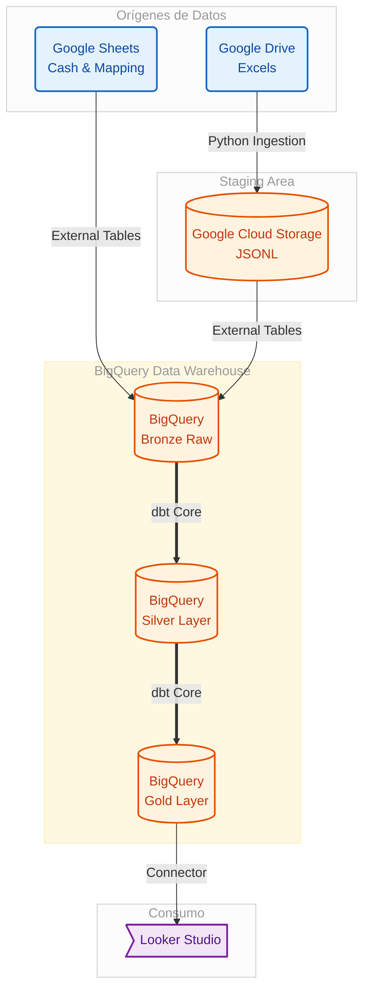

<div align="center">
<!-- Puedes sustituir este logo por uno tuyo si lo tienes, o un icono financiero -->


<h1>DWH Financial Data Warehouse</h1>

[](LICENSE) [](https://github.com/itdevelopment-galenicum/DWHGalenicum/issues?q=is%3Aissue+is%3Aopen+label%3A%22help+wanted%22) [](https://sites.google.com/galenicum.com/galenicum-dlh-documentation/basetis-documentation)

</div>

## About

This repository hosts the development and maintenance of a personal Data Warehouse for financial analysis. It is designed to centralize, clean, and transform banking data from multiple sources into a unified analytical layer ready for visualization.

Key components include:

- **Ingestion Engine**: Python scripts for extracting data from Google Drive (Excel) and loading it into Google Cloud Storage (GCS) and BigQuery.

- **Transformation Logic**: dbt Core models that implement business logic, categorization, and data cleaning.

- **Categorization Intelligence**: A hybrid system using keyword mapping and AI (Gemini) to classify transactions hierarchically.

- **Gold Layer**: Final mart tables optimized for BI tools like Looker Studio.

### Technologies used

<!-- CATEGORÍA 1: Cloud & Storage -->
#### Cloud & Storage


<!-- CATEGORÍA 2: ELT & Transformación -->
#### Ingestion & Transformation


<!-- CATEGORÍA 3: Orquestación & Inteligencia -->
#### *Orchestration & AI


### Architecture

This project follows a modern ELT (Extract, Load, Transform) approach:



### Architecture

This project follows a modern ELT (Extract, Load, Transform) approach:

```
graph LR
    A[Google Drive\n(Excels)] -->|Python Ingestion| B[Google Cloud Storage\n(JSONL)]
    B -->|External Tables| C[BigQuery\n(Bronze Raw)]
    D[Google Sheets\n(Cash & Mapping)] -->|External Tables| C
    C -->|dbt Core| E[BigQuery\n(Silver Layer)]
    E -->|dbt Core| F[BigQuery\n(Gold Layer)]
    F -->|Connector| G[Looker Studio]
```


## Getting Started

This guide will walk you through setting up your local environment for development and testing.


> [!NOTE]
> Prerequisites include:
> 1. **Python**: This project requires Python version 3.11+.
> 2. **Google Cloud Credentials**: A Service Account JSON key with permissions for BigQuery, Storage, and Drive API. You can download this from your Google Cloud Console under `APIs & Services > Credentials`.
> 3. **Gemini API Key**: (Optional) For AI-powered categorization features.


### Working from local

#### 1. Environment Setup

Clone the repository and install dependencies using the helper script.

Install Python dependencies

```bash
.\scripts\manage.ps1 install
```

#### 2. Configuration

Create a `.env` file in the root directory with your credentials and configuration:

```bash
GCP_PROJECT_ID=your-project-id
GCS_BUCKET_NAME=your-bucket-name
DRIVE_PARENT_FOLDER_ID=your-drive-folder-id
MAPPING_SHEET_ID=your-google-sheet-id
MAPPING_SHEET_NAME="dbt - mapping"
GOOGLE_APPLICATION_CREDENTIALS=./keys/gcp_key.json
GEMINI_API_KEY=AIza...
```

#### 3. Execution Commands

Use the `manage.ps1` script as your command center:

```bash
# Run Ingestion Pipeline (Drive -> GCS)
.\scripts\manage.ps1 run-ingestion

# Sync Mapping Rules from Google Sheets
.\scripts\manage.ps1 update-seeds

# Run AI Categorization Assistant
.\scripts\manage.ps1 ai-suggest

# Full dbt Refresh (Rebuild tables)
.\scripts\manage.ps1 dbt-refresh
```

### Project Structure

ingestion/: Python scripts for data extraction and loading.

config/: JSON configuration for bank file parsing.

transformation/: dbt project folder.

models/: SQL logic for Bronze, Silver, and Gold layers.

seeds/: CSV files for categorization rules (master_mapping.csv).

macros/: Jinja functions for logic reuse (categorize_transaction).

scripts/: PowerShell and Python utilities for local management and AI features.

Next tasks to include

[x] Implement hierarchical categorization (Group > Category > Subcategory).

[x] Integrate AI (Gemini) for suggestion of unclassified transactions.

[x] Automate Google Sheets mapping synchronization.

[ ] Create data quality tests for silver models.

[ ] Add visualization for monthly budget vs actuals.

[ ] Optimize incremental load strategy for large history.